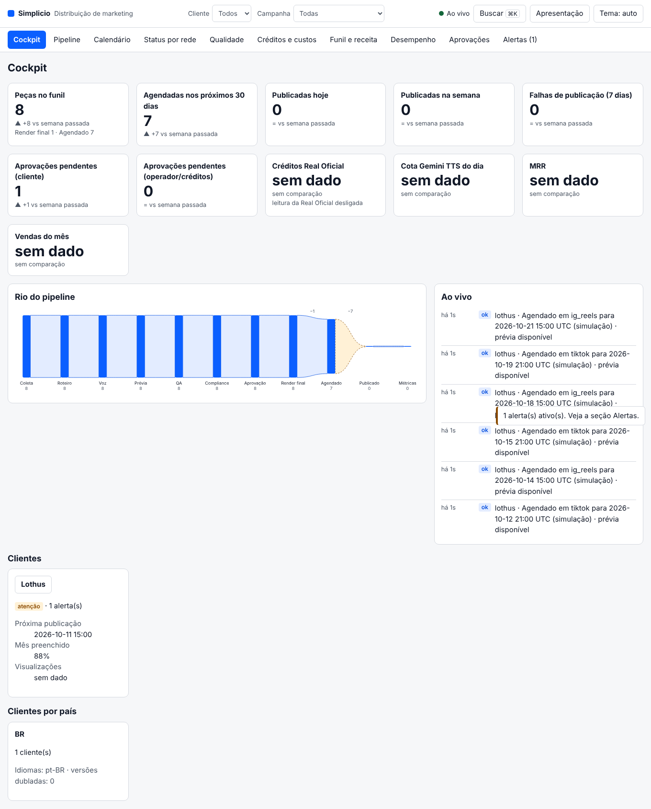

# Distribution dashboard

A local, read-only panel of the distribution loop: what is being produced, what waits for an approval, what was scheduled and published, what it cost and what it earned. It is started by the CLI, bound to the loopback address, and it never spends credit, charges a client or publishes: every route answers `GET` only.



## Start it

```bash
marketing-engine dashboard                  # prints the URL with a one-time session token and opens the browser
marketing-engine dashboard --no-browser     # print the URL only
marketing-engine dashboard --client lothus  # open on one client
marketing-engine dashboard --present        # presentation mode: client names and per-client values hidden
marketing-engine dashboard --status | --stop
marketing-engine dashboard --snapshot out.html --client lothus --month 2026-10   # the static, client-safe month page (sending it is manual)
```

The printed URL carries the token; the first page load trades it for an `HttpOnly`, `SameSite=Strict` cookie. A bad or missing token shows how to recover instead of a blank page.

## Sections

| Section | Route | What it shows |
| --- | --- | --- |
| Cockpit | `/api/clients`, `/api/events` | KPIs with the week before, the river of pieces, the live feed, client health |
| Pipeline | `/api/pipeline` | every piece in every stage with timings, retries and variations |
| Calendário | `/api/calendar` | the month by network in each client's time zone; a next-cycle slot never reads as scheduled |
| Status por rede | `/api/status` | client by network matrix, publisher session health, connected accounts against the plan, receipts and their evidence |
| Qualidade | `/api/quality` | the seal of every gate per piece (technical QA, compliance, watcher, licenses, approval, AI label) and the first-try rates |
| Créditos e custos | `/api/credits` | Real Oficial balance and spend, voice quota, LLM cost, cost per preview and per sale (estimates are labelled) |
| Funil e receita | `/api/funnel` | prospect to subscription funnel by country and batch, MRR, revenue per processor, churn, LTV |
| Desempenho | `/api/performance` | ranking by metric, winners and the variations planned from them, format, hook and language comparison, growth |
| Aprovações | `/api/approvals` | the client's unanswered approval links and the owner's decisions, with an SLA colour |
| Alertas | `/api/alerts` | what threatens a post or a sale, toast and opt-in desktop notification |

Event contract, sources and the meaning of every number: [DASHBOARD_EVENTS.md](DASHBOARD_EVENTS.md).

## Rules the panel keeps

- A number a source did not report is "sem dado", never zero, and stays out of sums, means and conversions.
- An estimate is labelled as one (the dollar comes from `PTAX_USD_BRL`, a Real Oficial credit from `RO_CREDIT_BRL`); without the rate the value is "sem dado".
- Real Oficial is reached only through a read-only window of four tools (`ro_whoami`, `ro_list_projects`, `ro_list_renders`, `ro_list_social_accounts`), cached; the tools that spend are not reachable and a test proves it.
- A dry-run schedule is labelled as a simulation and never counts as a post.

## Privacy (LGPD)

- Contact data (e-mail, phone) is removed from every free-text field before it enters the event stream, and the adapters read the factory's files through an allow-list, so a prospect's contact fields never enter. A test plants a name, e-mail, phone and cookie in every source and scans every response of the API and the live stream.
- Presentation mode (`?present=1`, `--present`) replaces client names with stable aliases in every response and drops every per-client value.
- The static month page for a client has no costs, credits, hashes, approver names, failure internals or anything about another client.
- Receipts' free text is redacted (cookies, tokens, passwords, keys, e-mails); the panel serves a receipt's screenshot only from the evidence folder.

## Security

- Bound to `127.0.0.1`; the `Host` and `Origin` headers must be the server's own; every `/api` route needs the session token (bearer, cookie or the printed URL).
- `GET` and `HEAD` only (`405` otherwise). Content-Security-Policy `default-src 'none'; script-src 'self'; style-src 'self'; ... frame-ancestors 'none'`, `nosniff`, `no-referrer`, `no-store`. The page has no inline script, style or handler, and builds its DOM from text only.
- Path traversal: media and evidence are resolved only inside the allowed folders; ids are matched against strict patterns first.
- Nothing leaves the machine unless the operator sets `MARKETING_DASHBOARD_ALERT_WEBHOOK`.

## Accessibility

Semantic landmarks, a skip link, one `h1` per section, tables with scoped headers, scroll regions that take the keyboard, a visible focus ring, `aria-live` announcements for loading and for new alerts, light and dark themes, reduced motion respected, and a layout that reflows at 360 px. A live refresh waits while someone is working inside the page and never takes the focus away. Checked with axe-core on every section in both themes (WCAG 2.2 AA rules).

## Measurements

Measured in a real browser and in process, on this build (numbers from the gate that accompanies the change; `e2e/dashboard-perf.spec.ts`, `tests/integration/dashboard-soak.test.ts`, `e2e/dashboard-a11y.spec.ts`, `npm run bench`):

| What | Budget | Measured |
| --- | --- | --- |
| Largest contentful paint, every section, local server, 30 day plan on 2 networks (about 60 pieces) | under 1.5 s | cockpit 288 ms, pipeline 228 ms, calendar 160 ms, status 76 ms, quality 100 ms, credits 88 ms, funnel 64 ms, performance 84 ms, approvals 72 ms, alerts 104 ms |
| Browser session that keeps refreshing (25 live refreshes) | no growth | DOM nodes 600 to 600, event listeners 27 to 27, JS heap 1.6 to 1.7 MB |
| Server session of 8 hours in accelerated time (480 simulated minutes: 5760 events, 480 stream reconnects, 2880 section reads) | memory follows the stored events | heap 24.2 MB at minute 60, 26.2 MB at minute 480; 0.35 KB per stored event; 0 streams left attached |
| axe-core, WCAG 2.2 AA rule tags plus best practice | no violation | 0 on 10 sections in light and dark, on the piece drawer, the day drawer, the receipt drawer, the command palette and presentation mode |
| Reflow at 360 px | no sideways page scroll | none in the 10 sections |
| Section read time (`npm run bench`, 5 clients and 60 pieces) | | cockpit 2.12, pipeline 3.00, calendar 0.06, status 0.35, quality 0.96, credits 0.31, funnel 0.21, performance 0.77, approvals 0.19, alerts 0.52 (ms per read) |

What the checks found and fixed while they were written: four places where contact data could reach a response (the client's note on a piece, the approver's name in the approval queue, phone numbers and a session cookie in a receipt's text), inline styles that the page's own policy blocked (the spacing of every section had silently not applied), and axe-core violations in 7 of the 10 sections (a theme button whose name did not contain its text, a calendar that was not a valid ARIA grid, headings that skipped a level, a scrolling feed the keyboard could not reach, the info colour at 4.3:1 on its own background, a duplicated landmark name, a listbox with no name, and a card grid that overflowed at 360 px), plus a skip link whose `#main` the app read as a navigation, so using it on any section jumped to the Cockpit.

## Tests

`tests/integration/dashboard-*.test.ts` (views against reference computations, server, privacy and security, soak), `tests/unit/dashboard-*.test.ts` (events, snapshot, state), and the browser specs `e2e/dashboard-*.spec.ts` (every section, live updates, keyboard, axe-core, performance). Reference screenshots: `docs/evidence/dashboard/`.

## Known limits

- The `frontend-design` skill was not available when the sections were built, so the visual direction is the shared shell of the first sections, not the output of that skill.
- Retention, purchase history, render machine time and thumbnails have no source yet; the panel says "sem dado" or "sem fonte" for them.
- There is no approve, reject, send, buy or render action: deciding goes through the CLI and its action gate.
